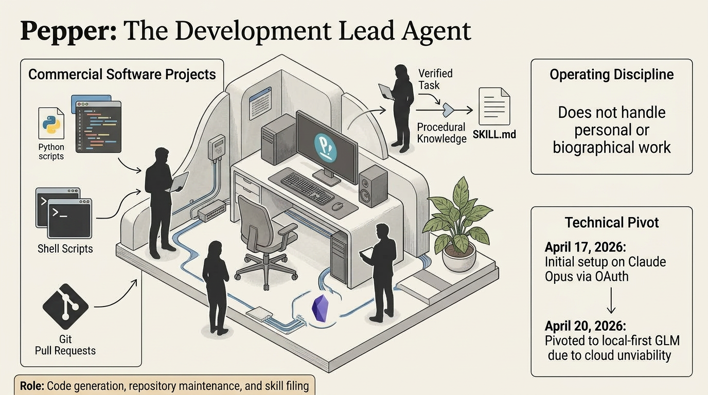
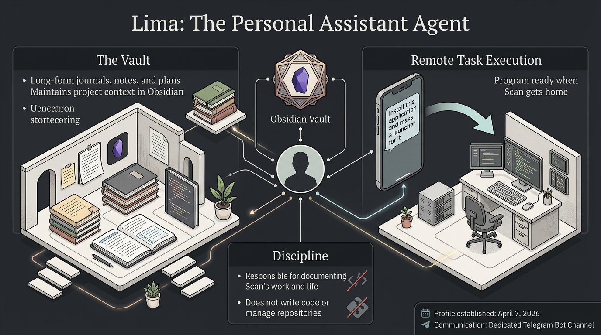

# Agents

Three agents are defined in LIMA. Two are operational; one is in design.

## Pepper

Pepper is the development lead for Scan's commercial software projects. Her scope is code, scripts, version control, and the procedural discipline that surrounds them. She writes, commits, tests, and opens pull requests. She does not push to remote repositories without explicit per-commit permission. She does not run privileged commands without interactive approval. She does not handle personal or biographical work — that belongs with Lima.

Pepper runs on a 9B-parameter quantized local model. Her memory contains world-facts about Scan's development environment, the projects she maintains, and the discipline expected of her. Her skill library — built up over her operational lifetime — covers gate-checking a repository before touching it, investigating specific classes of bugs, following Scan's preferred commit-and-PR workflow, and handling the handoff between sessions when her own context approaches its ceiling.

Her operating discipline is strict by design. She reports work in a short fixed format: what was done, what was changed, what is next. She asks rather than assumes when her confidence is below 90%. She never claims something is done that she has not verified. She keeps session length short when possible, commits state frequently, and writes handoff files when a session needs to end mid-task.

Most of what Pepper does well is narrow, repeatable, and well-scripted. When she encounters work outside that zone — unfamiliar architecture, cross-document synthesis, novel debugging — she stops and surfaces the problem. Scan then consults the advisor and returns with a concrete next step.

**A concrete example.** Scan inherited a partially-completed codebase from an earlier development phase, with 21 modified files, 4 unpushed commits, and around 50 untracked files in various states of readiness. The question was not "does this code work" — it was "what is safe to commit, what needs review, what should be archived." Pepper's first task was to run a gate-check (verifying canonical paths, remotes, and commit counts), then produce a structured inventory of uncommitted work, then investigate one specific suspected data-leak in a small region of the code. She completed the investigation, reported a false-positive with evidence, and left the rest of the inventory for Scan's triage. Total Scan attention required: about forty minutes across two short sessions.

## Lima

Lima is Scan's personal assistant. Her domain is Scan's own life and work, documented progressively over time. She maintains an Obsidian vault with a structured set of directories: a running journal, a biographical record, a library of reference material collected over time, and project-context files for ongoing initiatives. Her primary rhythms are morning planning and evening journaling; other tasks are handled on request.

Lima also helps with practical day-to-day work on the machine itself. Scan switched to Linux (specifically Pop!_OS) after a long absence from it, precisely to build this system, and Lima handles a lot of the small friction of running an unfamiliar environment. A typical message to Lima while Scan is standing in line at a store might be a URL and an instruction: "install this, make a launcher for it, I'll use it when I get home." When Scan sits down at the machine, the application is installed, a desktop icon is in place, and Lima has recorded what she did in her journal. The install itself is not technically impressive. The value is that the request happened at the moment Scan had the thought, not at the moment Scan had the time.

Lima runs on the same model weights as Pepper. She has her own profile, her own memory, and her own skill library, all of which are isolated from Pepper's. She does not touch Pepper's repositories. Pepper does not touch Lima's vault. This separation is enforced by the agents' own operating discipline and by the filesystem layout; it has held up reliably.

Lima's work is inherently private. She writes about Scan's thoughts, plans, health, finances, and relationships as documented by Scan. None of this content appears in this repository or in any other public surface. Where Lima is referenced in public-facing material (including this file), only her role and operational patterns are described, never her content.

Lima has been operational longer than Pepper. Scan treats her as the senior agent in the system — not more capable in any technical sense, but more proven in her routine.

Lima's current profile is the latest in a series of iterations. Earlier versions lived on commercial chat platforms (ChatGPT, DeepSeek, SuperGrok), used both as assistants and as session-archiving surfaces while Scan searched for a workable local architecture. The first serious local attempt used direct Ollama with a custom web UI; subsequent attempts used OpenClaw and Luna. None of those made it to production use. The current shape — Hermes Agent runtime, local Ollama for inference, a structured Obsidian vault for knowledge — came together on April 7, 2026.

## Studio

Studio is in development. Her intended scope is Scan's public-facing web presence: landing pages, design assets, and the integration with local image-generation tooling (specifically ComfyUI, accessed via its local HTTP API) for visual content.

Studio will be the first agent in LIMA whose work is inherently public-facing. Pepper's work ships to private repositories and commercial products; Lima's work stays on Scan's machine. Studio will produce content intended to be seen by people outside Scan's immediate circle. This changes the verification loop: her work products will be reviewed on a staging URL before anything is published, and her memory will track the published state so that revisions are deliberate rather than accidental.

The initial scope is narrow by design. Studio's first real project is a landing page for one of Scan's commercial projects. The page will serve two sequential audiences — first a closed group of beta testers during pre-launch validation, then a business-facing audience for partner onboarding — but as a single URL whose content is swapped when the project phase changes. Studio will hold both content sets in her repository and handle the swap deliberately on Scan's signal.

Studio's ComfyUI integration is the capability that most distinguishes her from Pepper. She will not design or tune the image-generation workflows herself — those are built and tuned by Scan in ComfyUI's graphical environment, then saved in API format. Studio's role is to invoke workflows with the right parameters and integrate the output into web pages. The judgment stays with the human; the operation is the agent's.

Studio does not yet exist as a running process. Her `SOUL.md` is in draft; her skill library has not been started. Her first task on first boot will be to establish a working deployment path to a staging environment, under supervision.

## Interactions between agents

The agents do not talk to each other directly. All coordination passes through Scan. If Pepper's work needs documentation in Lima's vault, Scan carries that across. If Studio eventually needs brand context from Pepper's projects, Scan carries that across. This is deliberate: each agent's memory stays focused on its own job, and no agent's context becomes polluted with another agent's concerns.

The constraint makes the system easier to reason about. When something goes wrong, the failure is localized to one agent, and the responsibility for the cross-agent information is on the human. It also keeps the multi-agent story honest — this is not a single hive mind, and claiming otherwise would misrepresent how the system actually behaves.
