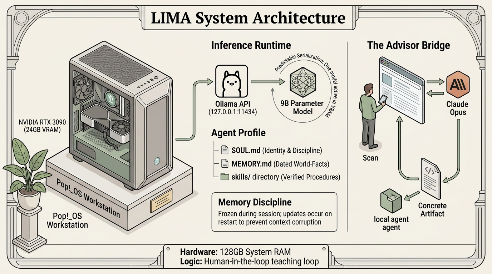

# Architecture

This document describes how LIMA is built today and the reasoning behind the current shape.

## Hardware

A single workstation running Pop!_OS with an NVIDIA RTX 3090 (24 GB VRAM) and 128 GB of system RAM. All agent inference runs on this machine. No cloud inference is used for any agent's normal operation. Mobile devices exist for product testing but are not part of the agent runtime.

## Inference runtime

Ollama serves the local models over an OpenAI-compatible HTTP API on the loopback interface. The agent runtime reaches it at `127.0.0.1` on the default port. Only one model is hot in VRAM at a time. When a second agent requests inference while the first is active, the second request waits until the first completes. This is handled as a house rule — not a technical limitation — because Scan decided that predictable serialization is more valuable than resource juggling for a two-agent (soon three-agent) system on one GPU.

The model in active use is a 9B-parameter quantized model pulled from a public model hub. Several other models are installed for experimentation; they are not part of the production loop. The system is designed to tolerate the model being swapped at the agent's configuration level without changes to skills, memory, or architecture. This has been tested once.

## Agent runtime

Each agent is a profile under the Hermes Agent framework. A profile directory contains:

- A `SOUL.md` describing identity, role, operating discipline, and off-limits areas
- A `MEMORY.md` holding facts the agent needs across sessions, written as discrete entries separated by a delimiter so individual entries can be replaced without clobbering the rest
- A `skills/` directory holding skill modules the agent has written or been given
- Configuration for which channel the agent exposes (Telegram, in every case), and which model it runs on

`SOUL.md` and `MEMORY.md` are loaded at session start and treated as frozen for the duration. Edits on disk take effect on the next session, not the current one. This constraint was learned after trying to treat memory as a live editable surface and watching context corruption ensue.

## Memory discipline

Agent memory is organized into two layers with different update rules:

- **World-facts** live in `MEMORY.md` as discrete entries. Each entry is self-contained and attributed to a date. Entries are added deliberately after Scan or the advisor confirms the fact is stable enough to persist. Entries are rarely deleted; they are superseded by newer entries when state changes.
- **Procedural knowledge** lives in skill files. A skill describes how to do a specific repeatable thing. Skills are added only after the agent has actually completed the procedure at least once. A skill covering a procedure the agent has not executed is considered unverified and is not installed.

Work products — inventories, handoff files, plans, commit-ready change sets — are written to the repository being worked on, not to the agent's memory. An agent resuming work on a project reads the project's own state files, not its own memory, to rebuild context. This separation has held up well; memory stays small and focused, while project state stays with the project.

## The advisor bridge

Scan maintains a subscription to a frontier model, accessed through that model's own web interface, for strategic judgment work the local agents cannot do reliably. This is not automated. When an agent hits the edge of its capability, it stops and reports the blocker. Scan takes the problem to the advisor, discusses it, and returns to the agent with a concrete artifact: a script to run, a skill to install, an instruction to follow.

The key architectural property: the advisor is accessed by the human, not the agent. The agent has no credentials, no network path, no automatic escalation. This keeps costs predictable, keeps the advisor relationship deliberate, and — most usefully — forces the advisor's output to take the shape of something the local agent can actually execute. A browser-based advisor cannot invoke tools or move files; it can only produce text that the human then applies. This constraint is a feature, not a bug.

## Skills as a teaching loop

When the advisor produces a procedure that worked, Scan captures it as a skill in the local agent's profile. The next time similar work is needed, the agent has the procedure on hand and does not need the advisor. Over time, the local agent's competence grows in exactly the directions real work has demanded. Scan calls this the teaching loop.

The teaching loop is what justifies the setup. A 9B local model is not, in general, as capable as a frontier model. But a 9B local model with a well-curated skill library, focused on a specific job, can do the narrow version of that job reliably — and the advisor bridge exists to handle the cases that would otherwise stop progress.

## What was tried and rejected

Several architectures were considered before landing on the current shape.

**Cloud-first agent, advisor on call.** The initial plan was for the development-focused agent to run on Claude Opus via a third-party OAuth integration, drawing from Scan's subscription. This burned through a pre-paid "extra usage" pool quickly, because third-party tool usage is billed separately from subscription usage under current policy. Session costs were unpredictable and quickly made the system operationally unviable. Rejected.

**Cloud-first with a smaller model.** Sonnet or Haiku instead of Opus. Same billing category, same problem, slower burn rate. Rejected.

**Fully cloud-free, no advisor.** The local agent alone. This was Scan's original instinct on day one, argued out of at the time. It turns out to have been correct — but only when paired with the advisor bridge, which makes up for the local model's ceiling without adding per-call cost.

The current shape — local agents doing the ongoing work, a human-mediated frontier advisor for judgment — emerged from walking back through those rejections. It is cheaper than the cloud-first approach, more capable than the cloud-free approach, and more honest about the local model's actual capabilities than either.

## What the architecture does not claim

The system does not claim the local agents are as capable as frontier models. They are not. The claim is narrower: a specialized local agent, focused on a specific job, with a well-curated skill library and an advisor bridge for out-of-distribution problems, can produce reliable useful work on consumer hardware at a known fixed cost. Scan is gathering evidence for this claim by actually running the system on real projects. Whether the evidence holds up over a longer window is the open question.
